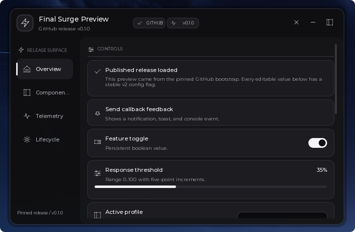

# Surge

Surge is a reusable, self-contained Luau UI library for scripts executed through an internal Roblox executor such as Potassium. It is **not** a Roblox Studio project and it is **not** a ModuleScript package.

## Final preview

The repository includes a screenshot of the GitHub-loaded Final Preview:



## Project layout

```text
.Surge/
  Surge.lua                 -- standalone library entry point
  README.md                 -- this guide
  PRODUCT.md                -- product/runtime constraints
  DESIGN.md                 -- visual system contract
  LICENSE                   -- Surge code license
  THIRD_PARTY_NOTICES.md    -- Lucide/Rayfield/Potassium notices
  assets/
    README.md
    LucideBridge.lua         -- local Lucide.Lua-style PNG bridge
    lucide-*.svg            -- source-level Lucide references
  Final-Surge-Preview.lua    -- GitHub release preview
  SurgeBootstrap.lua         -- optional pinned GitHub bootstrap template
```

The preview is intentionally outside the library folder:

scripts/Final-Surge-Preview.lua
```

## Loading with Potassium

Potassium documents executor filesystem functions as operating relative to its `workspace` directory. The safe, explicit loader below reads the library from `.Surge` and gives `loadstring` a chunk name for errors:

```lua
local source = readfile(".Surge/Surge.lua")
local chunk, compileError = loadstring(source, "@.Surge/Surge.lua")
assert(chunk, compileError)
local Surge = chunk()
```

`loadfile(".Surge/Surge.lua", "@.Surge/Surge.lua")` is also documented, but the current Potassium page's signature requires a chunk name while its example omits it. The `readfile` + `loadstring` form avoids relying on that documentation inconsistency.

The `scripts/Final-Surge-Preview.lua` location is the local delivery path for the GitHub release preview. Potassium's public filesystem docs do not promise that an absolute path outside `workspace` can be passed to `readfile`, so use the preview through the Potassium script runner or copy it into the executor workspace when that runner requires workspace-relative files.
## GitHub distribution and workspace setup

The published release currently pins `Surge.Distribution.Repository = "https://github.com/chineseAIslut/Surge"` and `Surge.Distribution.Ref = "v0.1.0"`. Future releases must update both together; the ref must remain an immutable release tag or commit.

`Surge:GetBootstrap()` returns a short Potassium bootstrap only when both values are configured. The bootstrap uses Potassium's documented `request` API, requires a successful 2xx response, writes the pinned library and Lucide bridge into workspace-relative managed paths, checks the library version, and then loads the chunk. Mutable refs such as `main`, `master`, `dev`, and `latest` are rejected. The core library remains usable offline and does not download code automatically unless `EnsureAssets()` is explicitly called.

```lua
local bootstrap, bootstrapError = Surge:GetBootstrap()
assert(bootstrap, bootstrapError) -- fails clearly when a release pin is unset
local loaded = assert(loadstring(bootstrap, "@SurgeBootstrap"))()
```

On first window creation, `Surge:EnsureAssets()` creates this workspace-relative tree without touching personal configs:

```text
Surge/
  Assets/
    LucideBridge.lua
    IconCache/
  Configs/
    <scriptId>/
  Managed/
    Surge.lua
    manifest.json
```

Existing valid managed files are reused. If no repository is configured, the local `.Surge/assets/LucideBridge.lua` source is copied into the managed bridge path when possible. A configured repository is fetched only through Potassium's `request`; failed status codes, empty bodies, invalid source markers, and write failures are reported and never accepted as valid managed files. Existing valid cache files remain usable on download failure.

## Config API

Version 2 is enabled with an explicit script identifier:

```lua
local window = Surge:CreateWindow({
    id = "ExampleWindow",
    configuration = {
        version = 2,
        enabled = true,
        scriptId = "ExampleScript",
        customFolder = "Surge/Configs",
        fileName = "Example",
        callbacksOnLoad = false,
        autoLoad = true,
        autoSave = true,
        saveDelay = 0.35,
    },
})
```

Use explicit, stable flags for every value that should persist:

```lua
local toggle = tab:CreateToggle({
    name = "Enabled",
    flag = "Enabled",
    value = false,
})

window:Save("ProfileA")
window:Load("ProfileA")
window:ListConfigs()
window:DeleteConfig("ProfileA")
window:ResetDefaults({ callback = false, save = false })
window:GetConfigErrors()
```

The v2 format is `{ schema = "Surge.Config", version = 2, scriptId, windowId, values }`. Each value stores its type and serialized value. Flags are validated and duplicate registrations are reported without replacing the first handle. Unknown flags are ignored; invalid values are skipped while valid values continue loading. Future schema versions and a config belonging to another `scriptId` are rejected without modifying the UI.

`callbacksOnLoad` defaults to `false`. With the default, loading updates UI state without invoking user callbacks. Set it to `true` when callback side effects are desired. Automatic saves are debounced by `saveDelay`; a slider movement does not write a file for every input event. Missing, malformed, or legacy v1 files return a controlled error/summary and are never silently overwritten. `ResetDefaults` restores the values captured when flagged controls were registered.

Configuration names and v2 `scriptId` values are restricted to workspace-safe components. Configs are namespaced as `customFolder/<scriptId>/<fileName>.json`. Version 1 remains available for existing callers without `configuration.version`; it preserves the legacy path and fallback-name behavior.


## Minimal window

```lua
local source = readfile(".Surge/Surge.lua")
local chunk = assert(loadstring(source, "@.Surge/Surge.lua"))
local Surge = chunk()

local window = Surge:CreateWindow({
    id = "Example",
    name = "Example controls",
    subtitle = "Loaded through Potassium",
    logo = "Zap",
    toggleKeybind = "RightShift",
})

local tab = window:CreateTab({ name = "Home", icon = "House" })
tab:CreateToggle({
    name = "Auto sprint",
    value = false,
    flag = "AutoSprint",
    callback = function(value)
        print("Auto sprint:", value)
    end,
})
```

The library accepts both the documented Gen2-style lowercase keys (`name`, `callback`, `value`) and Rayfield-style PascalCase aliases (`Name`, `Callback`, `CurrentValue`) for the supported options.

## Public API

### Library

- `Surge.Version` / `Surge:GetVersion()` — library version.
- `Surge:CreateWindow(options)` — create a new window. If another window has the same `id`, its tracked UI and connections are unloaded first.
- `Surge:GetWindow(id)` — get a shared window by id.
- `Surge:Destroy(id)` — unload one shared window.
- `Surge:DestroyAll()` — unload every Surge window created in the current executor global environment.
- `Surge:RegisterIcon(name, definition)` — add a custom code-drawn icon.
- `Surge:CreateIcon(parent, name, options)` — draw one icon in an existing Roblox UI instance.
- `Surge:EnsureWorkspace()` — create the managed workspace tree without overwriting user files.
- `Surge:EnsureAssets()` — reuse or prepare managed library/Lucide files; network access is explicit and requires a configured pinned distribution.
- `Surge:GetBootstrap()` — return a pinned GitHub bootstrap or a clear error when repository/ref are unset.

### Window options

| Option | Type | Notes |
| --- | --- | --- |
| `id` | string | Shared registry key used for repeated-load cleanup. |
| `name` | string | Title in the top bar. |
| `subtitle` | string | Secondary line below the title. |
| `logo` / `icon` | string | Built-in icon name; defaults to `Zap`. Runtime icons are local UI primitives. |
| `theme` | string/table | `Monochrome`, `Graphite`, or a partial token table. |
| `showName` | string | Label on the collapsed pill. |
| `toggleKeybind` | string/EnumItem | Key that calls `ToggleHide`. |
| `width`, `height` | number | Initial window size, constrained to a usable range. |
| `sidebarWidth` | number | Tab rail width. |
| `cornerRadius` | number | Rounded window radius. |
| `onError` | function | Optional callback for callback failures. Without it, a notification is shown. |
| `version` / `scriptId` | number/string | Version 2 uses namespaced safe paths and explicit stable flags. |
| `callbacksOnLoad` | boolean | Default `false`; loading updates UI without callbacks unless enabled. |
| `autoSave` / `autoLoad` | boolean | Optional debounced save and first-load behavior. |
| `configuration` | table | Optional workspace-relative persistence adapter; see below. |

Window methods:

```lua
window:CreateTab({ name = "Home", icon = "House" })
window:CreateTag({ name = "BETA" })
window:CreateSection({ name = "Sidebar section", icon = "PanelLeft" }) -- visible rail heading
window:Show()
window:Hide()
window:ToggleHide()
window:ToggleMinimise()
window:Navigate("Home")
window:ChangeTheme("Graphite")
window:Notify({ title = "Saved", content = "Configuration written." })
window:Toast({ title = "Ready", subtitle = "Callback completed" })
local popup = window:Popup({
    title = "Confirm",
    content = "Continue?",
    options = {
        { text = "Cancel" },
        { text = "Continue", style = "primary", callback = function() end },
    },
})
popup:Close()
window:Unload()
```

`Unload` destroys the ScreenGui and disconnects connections registered by Surge. It does not undo behavior created by your callbacks; script logic remains your responsibility.

### Tabs and groups

```lua
local tab = window:CreateTab({ name = "Controls", icon = "SlidersHorizontal" })
tab:Select()
tab:Deselect()
local group = tab:CreateGroup({ direction = "row" })
```

`direction` accepts `row`/`horizontal` or `column`/`vertical`. Groups are intended for compact button, toggle, slider, stat, and text rows. Full-width fields are clearer when created directly on the tab.

### Common element options

Every element accepts `name`, `description`, and an optional built-in `icon`. Handles have `Remove()` where removal is meaningful. Value handles expose `.value` and `Set(value, skipCallback?)`; `Set` normally fires the same callback as user input.

#### Button

```lua
local button = tab:CreateButton({
    name = "Reset",
    description = "Runs one callback.",
    icon = "RefreshCw",
    callback = function() end,
})
button:Set("Reset now")
button:Fire()
```

#### Toggle / Switch

```lua
local toggle = tab:CreateToggle({
    name = "Auto sprint",
    value = false,
    flag = "AutoSprint",
    callback = function(value) end,
})
toggle:Set(true, true) -- update UI without firing the callback
toggle:Lock("Requires setup")
toggle:Unlock()
```

`CreateSwitch` is an alias for `CreateToggle`.

#### Slider

Options: `range = { min, max }`, `increment`, `value`, `suffix`, `flag`, `forgetState`, `callback(value, dragging)`.

```lua
local slider = tab:CreateSlider({
    name = "Field of view",
    range = { 70, 120 },
    increment = 1,
    value = 90,
    suffix = "°",
    callback = function(value, dragging) end,
})
slider:Set(100)
```

#### Dropdown

Options: `options`, `value`, `multiSelect`, `placeholder`, `flag`, `forgetState`, `callback`.

```lua
local dropdown = tab:CreateDropdown({
    name = "Profile",
    options = { "Observe", "Operate", "Inspect" },
    value = "Observe",
    callback = function(value) end,
})
dropdown:Refresh({ "Observe", "Operate" })
dropdown:Add("Inspect")
dropdown:Remove("Observe")
dropdown:Set("Operate")
```

In single-select mode the callback receives a string. In multi-select mode it receives a copied table. The handle's `.value` is always a table.

#### Input

Options: `value`, `placeholder`, `numeric`, `clearOnFocus`, `removeTextAfterFocusLost`, `flag`, `forgetState`, `callback`.

```lua
local input = tab:CreateInput({
    name = "Operator note",
    value = "ready",
    placeholder = "Type a note",
    callback = function(text) end,
})
input:Set("updated")
```

The callback commits on focus loss. Numeric input rejects malformed text and restores the last valid value.

#### Keybind

Options: `value`, `hold`, `holdThreshold`, `flag`, `forgetState`, `callback`, `onChanged`.

```lua
local bind = tab:CreateKeybind({
    name = "Menu key",
    value = "F6",
    callback = function(keyOrState) end,
    onChanged = function(newKey) end,
})
bind:Set("F7")
```

Click the field to capture a keyboard or mouse button. Escape cancels capture; Backspace clears the bind. Hold mode calls the callback with `true` after the threshold and `false` on release.

#### Color picker

```lua
local picker = tab:CreateColorPicker({
    name = "Accent",
    color = Color3.fromRGB(220, 220, 224),
    alpha = 1,
    callback = function(color, alpha) end,
})
picker:Set(Color3.fromRGB(160, 160, 160))
picker:SetAlpha(0.8)
```

The preview palette and built-in themes are intentionally grayscale. The picker therefore offers grayscale swatches plus opacity rather than a hue map.

#### Read-only stat and progress

```lua
local stat = tab:CreateStat({ name = "Events", value = 0, suffix = " calls" })
stat:Set(4)
stat:ResetBaseline()

local progress = tab:CreateProgress({ name = "Setup", range = { 0, 5 }, value = 2 })
progress:Set(4)
print(progress:Get(), progress:GetPercentage())
progress:SetRange(0, 10)
progress:SetText("4/10")
progress:SetIndeterminate(true)
```

#### Console

```lua
local console = tab:CreateConsole({ name = "Log", height = 140, follow = true, maxLines = 200 })
console:Append("ready")
console:Set("replaced")
print(console:Get())
console:Copy() -- returns false if setclipboard is unavailable
console:Clear()
console:SetHeight(180)
```

#### Text and divider

```lua
local text = tab:CreateText({ name = "About", text = "Supporting copy." })
text:SetTitle("Updated")
local divider = tab:CreateDivider({ text = "advanced", spacing = 20 })
divider:Set("updated")
divider:Set(false) -- legacy visibility toggle
```

`CreateLabel` and `CreateParagraph` are aliases for `CreateText`.

## Themes

Themes are token tables. `Surge.Themes.Monochrome` and `Surge.Themes.Graphite` are the built-ins; custom tables can override any of these keys:

```lua
window:ChangeTheme({
    Surface = Color3.fromRGB(26, 26, 28),
    SurfaceRaised = Color3.fromRGB(34, 34, 36),
    Text = Color3.fromRGB(255, 255, 255),
    TextMuted = Color3.fromRGB(170, 170, 174),
    Border = Color3.fromRGB(70, 70, 74),
    Accent = Color3.fromRGB(235, 235, 238),
    WindowTransparency = 0.08,
})
```

Available tokens are `Window`, `Surface`, `SurfaceRaised`, `SurfaceInput`, `Overlay`, `Text`, `TextMuted`, `TextFaint`, `Border`, `BorderStrong`, `Accent`, `AccentContrast`, `ToggleOff`, `ProgressTrack`, `Danger`, `Icon`, `WindowTransparency`, `SurfaceTransparency`, `RaisedTransparency`, `InputTransparency`, and `OverlayTransparency`.

Theme changes update registered colors and refresh stateful controls. Roblox UI properties unsupported by a client build are left unchanged.

## Icons

Built-ins include `Zap`, `PanelLeft`, `House`, `Settings`, `SlidersHorizontal`, `ToggleRight`, `Terminal`, `Palette`, `Keyboard`, `Plus`, `X`, `ChevronDown`, `ChevronRight`, `Check`, `Minus`, `Info`, `Bell`, `Search`, `Copy`, `RefreshCw`, `Activity`, `CircleGauge`, `Moon`, and `Sun`. Common kebab-case names such as `panel-left`, `chevron-down`, and `circle-gauge` are accepted.

Custom icon definitions use 24×24 coordinates:

```lua
Surge:RegisterIcon("Signal", {
    segments = {
        { 4, 12, 8, 8 },
        { 8, 8, 12, 12 },
        { 12, 12, 16, 8 },
        { 16, 8, 20, 12 },
    },
})
```

The runtime first tries `assets/LucideBridge.lua`, a local Lucide.Lua-style SVG-node-to-PNG rasterizer. It caches small white PNGs under managed `Surge/Assets/IconCache/` and falls back to the legacy `.Surge/icon-cache/` when a valid cache file exists. It loads them through Potassium's documented `getcustomasset` and tints the resulting `ImageLabel` with the active grayscale theme. If filesystem/asset APIs are unavailable, or a name is outside the vendored subset, the local `Frame` renderer is used. The bridge itself does not perform network requests.
## Enhancement-pass APIs

### Localization

`CreateWindow` accepts `locale`, `translations`, and `translator`. Runtime methods are:

```lua
window:RegisterTranslations({ de = { ["Runtime controls"] = "Laufzeitsteuerung" } })
window:SetLocale("de")
window:SetTranslator(function(source, localeId)
    return source
end)
```

Localization currently refreshes tracked `TextLabel` copy. Dynamic field values, dropdown selection text, keybind capture text, and console output are intentionally treated as runtime state rather than stable translation keys. The locale defaults to `"en"`; player-locale discovery is not assumed.

### Reordering

Tab, group, section, text, divider, and value handles expose:

```lua
handle:MoveTo(index)
handle:MoveToTop()
handle:MoveToBottom()
handle:MoveUp()
handle:MoveDown()
```

Rows are reordered within their current tab/group container. Tags remain title-bar handles and are not part of element ordering.

### Sidebar sections and tags

`window:CreateSection({ name, icon })` creates a visible heading in the fixed Surge rail and returns a removable/reorderable handle. `window:CreateTag({ text, title, icon, color, order })` supports `SetText`, `SetIcon`, `SetColor`, `Set(table)`, and `Remove`. Tag colors are normalized to grayscale to preserve the Surge palette.
- `CreateWindow({ profile = "..." })` and `window:SetProfile(text)` render a compact rail footer label.

### Additional component options

- `CreateGroup()` defaults to `direction = "row"`; nested groups and `Group:CreateDropdown` are supported.
- `CreateDivider` accepts `text`, `spacing`, and `line`.
- `CreateConsole` reads `name`, `text`/`code`, `height`, `follow`, and `maxLines`; its description/icon are not currently rendered.
- `CreateConsole` keeps its fixed internal scroll viewport; long content does not expand the page.
- `CreatePopup` accepts `boxes` for changelog-style cards and scrolls the box list.
- `CreateToast` accepts `position = "Top"|"Bottom"` and `subtitleAbove`.
- `CreateColorPicker` is intentionally grayscale plus alpha, not a full hue/map picker.

## Deliberate differences from stable Rayfield Gen2

Surge keeps its fixed left rail, local Lucide PNG bridge with a code-drawn fallback, grayscale-only visual system, workspace-relative JSON persistence, and no Studio/ModuleScript contract. It does not automatically load remote models, fonts, or icon packages. The optional explicit distribution/bootstrap layer uses Potassium's documented `request` only when a release owner has configured an immutable repository ref.
## Visual QA notes

- Runtime icons prefer the local Lucide.Lua-style PNG bridge; SVG files under `assets/` are source references and are not passed directly to Roblox. The bridge uses only a bounded icon subset and falls back to Frame primitives.
- The bridge depends on Potassium filesystem/getcustomasset support. Potassium's public docs do not guarantee binary PNG write semantics or asset-cache behavior; the small sizes used by Surge were verified in the connected client.
- The menu background layer is centered on the same anchor and position as the window with equal six-pixel margins at the default size. Dragging and minimising update both positions together.
- Root borders are kept outside content clipping; Body, Sidebar, ContentHost, and tab pages own their clip boundaries. Tab pages include right-side inset padding so scrollbars do not cover row outlines.
- The collapsed pill uses a six-pixel drag threshold, clamps to the current viewport, preserves its `UDim2` position across Hide/Show, and only calls `Show()` for a click that did not move.
- Indeterminate progress keeps its 28%-wide fill inside the track's `0..0.72` travel range and clips the track itself with rounded corners.
- Hide/Show converts absolute morph targets into the owning `ScreenGui`'s local coordinate space before assigning `UDim2.fromOffset`; no fixed inset compensation is used.
- Tab transitions snapshot descendant transparency, fade the outgoing page before revealing the incoming page, and restore each original `BackgroundTransparency`, text/image transparency, and stroke value.
- Toast width/height are derived from the viewport and wrapped title/subtitle content. Toast items receive layout order and collapse their measured height on close so mixed-height stacks reflow.

## Animation

Surge keeps motion short and reversible through the public `Surge.Animation` table:

| Key | Default | Use |
| --- | ---: | --- |
| `Fast` | `0.10s` | Hover and short feedback |
| `Press` | `0.06s` | Button press response |
| `Toggle` | `0.12s` | Toggle knob |
| `Standard` | `0.16s` | Default `Window:_tween` duration |
| `Tab` | `0.14s` | Tab slide transition |
| `Menu` | `0.22s` | Hide-button morph |
| `Message` | `0.16s` | Toast/notification enter and exit |
| `Theme` | `0.18s` | Live theme color changes |

The default easing style is `Quad`. `EaseOut` is used for entry and direct response, `EaseIn` for exits, and `EaseInOut` is available for custom callers. Active tweens are cancelled before a replacement starts, so reversals continue from the current property value instead of competing with stale tweens.

Tab changes use a clipped 16-pixel horizontal slide after the outgoing page has faded out. The rail state changes immediately; a temporary input shield prevents outgoing pages and global control listeners from receiving input, and a generation token makes the newest selection authoritative during rapid changes.

Slider fills animate short programmatic changes and track clicks. Pointer movement during a drag cancels the fill tween and updates immediately, preserving range, increment, value, and callback semantics.

Notifications and toasts fade all visual descendants, then collapse their measured item height so UI-list siblings reflow smoothly. Manual `Close`, timeout expiry, and repeated calls share an idempotent close path. Toast text wraps within a viewport-derived width/height cap.

The hide/show transition uses one non-interactive morph surface. Absolute endpoints are converted from `ScreenGui` coordinates to local offsets before the morph, the current draggable pill rectangle is used as target, and the original menu `UDim2` position and size are restored when shown again.

Runtime timing depends on Roblox `TweenService`, frame scheduling, and executor behavior. Surge has no reduced-motion mode and no promise of frame-perfect durations; direct assignments remain the fallback when tween creation is unavailable.
- Pointer/pixel smoke checks require a connected Potassium client. Source inspection and preview wiring do not prove exact visual alignment, touch dragging, or frame timing.


## Optional persistence

Persistence is opt-in and workspace-relative:

```lua
local window = Surge:CreateWindow({
    name = "Persisted",
    configuration = {
        version = 2,
        enabled = true,
        scriptId = "PersistedScript",
        callbacksOnLoad = false,
        autoSave = false,
        autoLoad = false,
        customFolder = "Surge/Configs",
        fileName = "Persisted",
    },
})

local toggle = window:CreateTab("Home"):CreateToggle({
    name = "Remember me",
    flag = "RememberMe",
})

local ok, errorMessage = window:Save()
local loaded, loadError = window:Load()
local names = window:ListConfigs()
window:DeleteConfig("Persisted")
local folder, path = window:GetPath()
```

The adapter checks for Potassium's documented `readfile`, `writefile`, `isfile`, `isfolder`, `makefolder`, `listfiles`, and `delfile` globals. Missing functions return `false`/an empty list rather than using an undocumented fallback. Folder and file names are sanitized; Surge never accepts an absolute path from these options.

`window.Flags`, `window:Get(flag)`, and `window:Set(flag, value)` expose registered value handles. Stats, progress, console, text, and dividers are read-only or presentation elements and are not persisted.

## Dependencies and compatibility

Required runtime capabilities:

- Roblox client `Instance`, `Enum`, `Color3`, `UDim2`, `TweenService`, `UserInputService`, `RunService`, and `HttpService`.
- A UI parent: Potassium's documented `gethui()` is preferred; `CoreGui` is a fallback when accessible.
- `readfile` + `loadstring` only for the loader/preview, not for window construction.

- `request` for explicit, configured GitHub asset/bootstrap downloads; the core loader remains offline by default.
Optional capabilities:

- Filesystem functions for persistence.
- `setclipboard` for `Console:Copy()`.
- `getgenv` for the shared repeated-load registry. `_G` is used as a fallback.

Surge does **not** implement or promise Rayfield's secure mode, anti-detection, asset fingerprinting behavior, remote model loading, key systems, Discord joins, remote fonts, or thumbnail caching. Its optional distribution layer performs only explicitly requested, pinned downloads through Potassium's `request` API. Potassium documentation states that executor capabilities and policies can vary, and current bridge status/capabilities must be checked before execution.

Known limitations:

- No Studio/ModuleScript compatibility contract.
- No guarantee that any non-Potassium executor exposes the optional globals.
- Public Potassium docs do not specify absolute-path, traversal, recursive-folder, encoding, or asset-cache behavior; the library does not rely on those assumptions.
- The runtime does not render the SVG files under `assets/`; they are source references and license-bearing design assets.
- The color picker is grayscale-only to preserve the requested palette.
- Surge always uses its fixed left rail; `sidebarLayout` switching, numeric/asset icon inputs, avatars, and remote fonts are intentionally unsupported.
- Callbacks are protected with `pcall`, but Surge cannot make callback code safe and does not suppress all executor/client output.

## Sources and licenses

- Potassium API: https://docs.potassium.pro/api-reference/introduction and https://docs.potassium.pro/llms.txt
- Rayfield: https://docs.sirius.menu/rayfield
- Rayfield Gen2: https://docs.sirius.menu/rayfield-gen2 and https://docs.sirius.menu/llms.txt
- Lucide: https://lucide.dev/ and https://github.com/lucide-icons/lucide
- Lucide.Lua renderer reference: https://github.com/xxpwnxxx420lord/Lucide.Lua (reviewed commit `11f7e707ee012c374e15808309f6ef9694c87c2d`)
- Notices and complete retained license text: `THIRD_PARTY_NOTICES.md`
- Surge source license: `LICENSE`

Rayfield's Apache License 2.0, Lucide's ISC/MIT notices, and the Lucide.Lua README's claimed MIT attribution are retained because the documented/reference source material is distributed or adapted. The Lucide.Lua repository did not contain a root LICENSE at the reviewed commit, so that MIT claim is explicitly marked unverified in `THIRD_PARTY_NOTICES.md`. Surge source remains independently implemented and is not endorsed by Rayfield, Rayfield Gen2, Lucide, Lucide.Lua, or Potassium.
